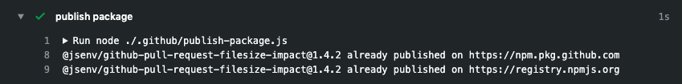
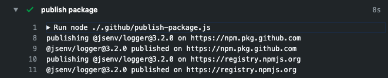

# Package publish

[](https://github.com/jsenv/jsenv-package-publish/packages)
[](https://www.npmjs.com/package/@jsenv/package-publish)
[](https://github.com/jsenv/jsenv-package-publish/actions?workflow=ci)
[](https://codecov.io/gh/jsenv/jsenv-package-publish)

Publish package to one or many registry. Can be used to publish on both npm and github registries for instance.

## Table of contents

- [Presentation](#Presentation)
- [Usage](#Usage)
- [API](#API)
  - [publishPackage](#publishPackage)
    - [projectDirectoryUrl](#projectDirectoryUrl)
    - [registriesConfig](#registriesConfig)
    - [logLevel](#logLevel)
- [Installation](#installation)

## Presentation

This github repository corresponds to `@jsenv/package-publish` package published on github and npm package registries.

This package is meant to automate `npm publish` at the end of your continuous workflow. It also facilitates your life when you want to publish to more than one package registry.

## Usage

You can use it inside a github workflow or inside any other continuous environment like Travis or Jenkins.

The following screenshot illustrates how this package can be integrated in a github workflow.

Screenshot taken inside a github workflow when the package.json version is already published: 

Screenshot taken inside a github workflow when the package.json version is not published: 

This package uses itself and is configured in this repository workflow file.<br />
— see [.github/workflows/ci.yml#publish-package](https://github.com/jsenv/jsenv-package-publish/blob/9bc6af39afa8825ff7fcdc475c3ede8e900c7475/.github/workflows/ci.yml#L39)

## API

The api consist into one function called `publishPackage`.

## publishPackage

> `publishPackage` is an async function publishing a package on one or many registries.

Implemented in [src/publishPackage.js](./src/publishPackage.js), you can use it as shown below.

```js
const { publishPackage } = require("@jsenv/package-publish")

publishPackage({
  projectDirectoryUrl: "file:///directory",
  registriesConfig: {
    "https://registry.npmjs.org": {
      token: process.env.NPM_TOKEN,
    },
    "https://npm.pkg.github.com": {
      token: process.env.GITHUB_TOKEN,
    },
  },
})
```

### projectDirectoryUrl

> `projectDirectoryUrl` parameter is a string leading to a directory containing the package.json.

This parameter is **required**, an example value could be:

```js
"file:///Users/you/directory"
```

Other representation of this information such as `"/Users/you/directory"`, `"C:\\Users\\you\\directory"` or an url instance are possible too.

### registriesConfig

> `registriesConfig` parameter is an object configuring on which registries you want to publish your package.

This parameter is **required**, an example value could be:

```js
{
  "https://registry.npmjs.org": {
    token: '1cdd34c7-c4d8-5eav-98dj-31a3419g385f' // this is a fake token
  }
}
```

### logLevel

> `logLevel` parameter is a string controlling verbosity of logs during the function execution.

This parameter is optionnal with a default value of:

```json
"info"
```

More information available at https://github.com/jsenv/jsenv-logger#loglevel

## Installation

If you never installed a jsenv package, read [Installing a jsenv package](./docs/installing-jsenv-package.md) before going further.

This documentation is up-to-date with a specific version so prefer any of the following commands

```console
npm install --save-dev @jsenv/package-publish@1.2.0
```

```console
yarn add --dev @jsenv/package-publish@1.2.0
```
