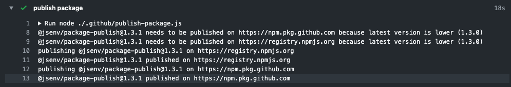

# Package publish

Publish package to one or many registry.

[](https://github.com/jsenv/jsenv-package-publish/packages)
[](https://www.npmjs.com/package/@jsenv/package-publish)
[](https://github.com/jsenv/jsenv-package-publish/actions?workflow=ci)
[](https://codecov.io/gh/jsenv/jsenv-package-publish)

# Table of contents

- [Presentation](#Presentation)
- [Installation](#installation)
- [Documentation](#Documentation)
- [publishPackage](#publishPackage)

# Presentation

This package is meant to automate `npm publish` at the end of your continuous workflow. Can be used to publish on both npm and github registries for instance.

You can use it inside a github workflow or inside any other continuous environment like Travis or Jenkins.

Screenshot taken inside a github workflow when the package.json version is already published: 

Screenshot taken inside a github workflow when the package.json version is not published: 

This package uses itself and is configured in the repository workflow file.<br />
— see [.github/workflows/ci.yml#publish-package](https://github.com/jsenv/jsenv-package-publish/blob/9bc6af39afa8825ff7fcdc475c3ede8e900c7475/.github/workflows/ci.yml#L39)

# Installation

```console
npm install --save-dev @jsenv/package-publish
```

# Documentation

The api consist into one function called `publishPackage`.

`publishPackage` is an async function publishing a package on one or many registries.

```js
import { publishPackage } from "@jsenv/package-publish"

const publishReport = await publishPackage({
  projectDirectoryUrl: "file:///directory",
  registriesConfig: {
    "https://registry.npmjs.org": {
      token: process.env.NPM_TOKEN,
    },
    "https://npm.pkg.github.com": {
      token: process.env.GITHUB_TOKEN,
    },
  },
})
```

— source code at [src/publishPackage.js](./src/publishPackage.js).

### projectDirectoryUrl

`projectDirectoryUrl` parameter is a string leading to a directory containing the package.json. This parameter is **required**.

### registriesConfig

`registriesConfig` parameter is an object configuring on which registries you want to publish your package. This parameter is **required**.

### logLevel

`logLevel` parameter is a string controlling verbosity of logs during the function execution.

— see also https://github.com/jsenv/jsenv-logger#loglevel
